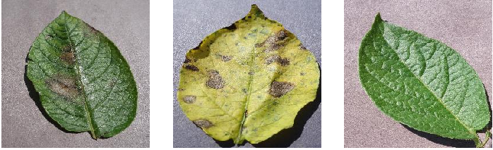

     
    
     

<h2 align="center">

Clasificación de enfermedades en hoja de papa usando CNN 🍃

</h2>

## 🐛 Problema
El tizón tardío y el tizón temprano son dos enfermedades que afectan a las plantas de papa y tomate de la familia de las solanáceas. Mientras que el tizón temprano es causado por el hongo Alternaria en temperaturas relativamente más cálidas, el tizón tardío es causado por el oomiceto Phytophthora en temperaturas más frías.

## 📙 Dataset
- [Potato Leaf](https://www.kaggle.com/datasets/abbasataiemontazer/potato-leaf) de Kaggle

## 👨‍💻 Maintainers
* Cristhian Wiki, Github: [HiroForYou](https://github.com/HiroForYou)
